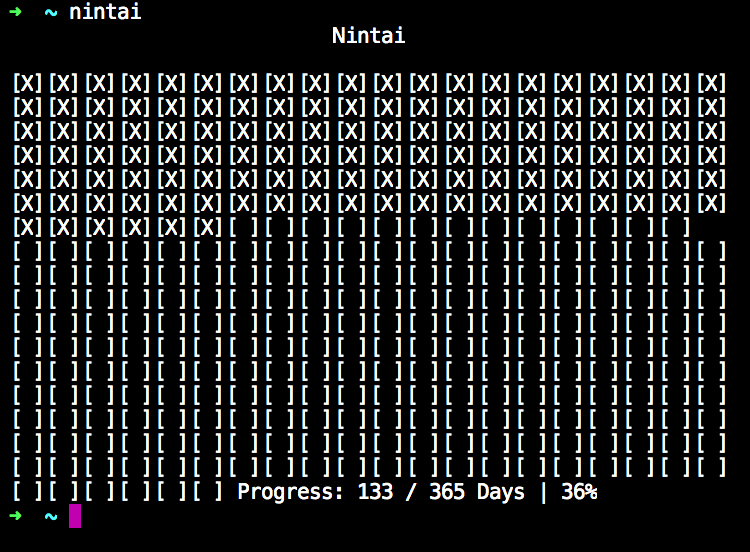

# Nintai

### Patience, endurance, perseverance - translation from Japanese

Simple visualisation node package, to show the current year progress.

### Getting started

```
  npm i -g nintai
  nintai
```

### Enjoy



* *Made with* 💚 *by* **[palevoo](https://github.com/palevoo)**

### Future

* Add argument field to specify custom beginning of the year (e.g your birthday)
* Config command to set (date, view option, launch option)
